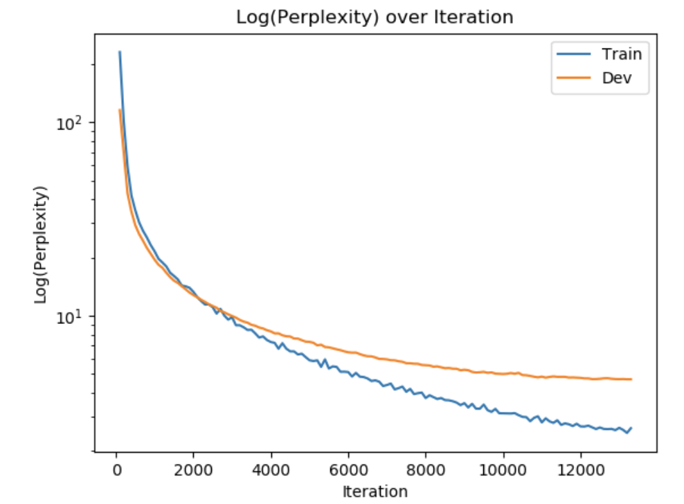
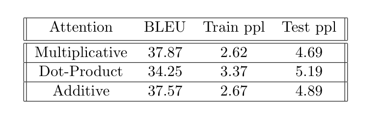

# Neural Machine Translation
Neural Machine Translation Project for Natural Language Processing

The aim of neural machine translation is to use neural networks to automatically translate a text in a language to another language.

In this project, we aim to obtain a good BLEU score, by implementing an encoder-decoder network with attention. In this project, I explore dot attention, multiplicative attention and additive attention, and find that multiplicative attention gives the best results. The default attention is multiplciative attention, and the other kinds of attention are placed in the "Submit" folder.

As the dataset is large and exceeds Github's storage, I have included the zip file in a link here: 

For the neural machine translation model, I train it for 49 epochs, and achieve the following log perplexities on the test and dev set.

The results are reported below.

